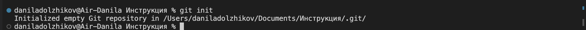
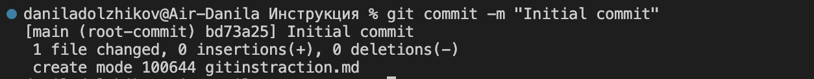
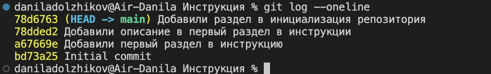
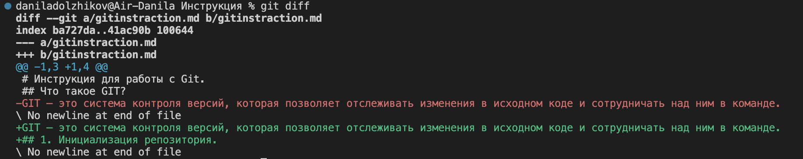
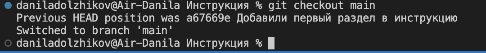
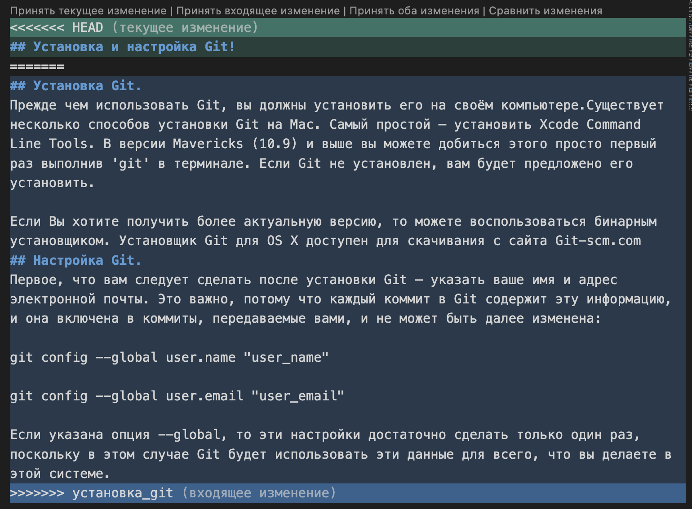

# Инструкция для работы с Git.
## Что такое GIT?
GIT — это система контроля версий, которая позволяет отслеживать изменения в исходном коде и сотрудничать над ним в команде.

## Установка Git.
Прежде чем использовать Git, вы должны установить его на своём компьютере.Существует несколько способов установки Git на Mac. Самый простой — установить Xcode Command Line Tools. В версии Mavericks (10.9) и выше вы можете добиться этого просто первый раз выполнив 'git' в терминале. Если Git не установлен, вам будет предложено его установить.

Если Вы хотите получить более актуальную версию, то можете воспользоваться бинарным установщиком. Установщик Git для OS X доступен для скачивания с сайта Git-scm.com
## Настройка Git.
Первое, что вам следует сделать после установки Git — указать ваше имя и адрес электронной почты. Это важно, потому что каждый коммит в Git содержит эту информацию, и она включена в коммиты, передаваемые вами, и не может быть далее изменена:

git config --global user.name "user_name"

git config --global user.email "user_email"

Если указана опция --global, то эти настройки достаточно сделать только один раз, поскольку в этом случае Git будет использовать эти данные для всего, что вы делаете в этой системе.

## Команды GIT:
### 1. Инициализация репозитория.
Команда **git init** - это команда, которая создает новый репозиторий Git, который будет отслеживать изменения в файлах в выбранной папке. После выполнения команды git создаст скрытую директорию .git в корневой папке, где будут храниться все данные. Команда git init выполняется только один раз при создании нового репозитория.

### 2. Сохранение изменений в файл.      
Команда **git add** - используется для добавления измененных или новых файлов в индекс, который является промежуточным этапом в Git перед созданием коммита. После добавления файлов в индекс вы можете использовать какманду *git commit* которая сохранит изменения в репозиторий.

Команда **git commit** - создает новый коммит в Git, который сохраняет изменения, добавленные в индекс с помощью команды *git add*.

### 3. Получение информации о истории коммита.
Команда **git log** - позволяет просмотреть историю и увидеть список всех созданных коммитов. При выполнении этой команды Git отображает список всех коммитов, начиная с самого последнего и заканчивая самым первым.

### 4. Сравнение с последним коммитом.
Команда **git diff** - позволяет просмотреть изменения, которые были внесены между двумя состояниями вашего репозитория. Это может быть полезно, например, если вы хотите увидеть, какие изменения были внесены в проект с момента последнего коммита.

### 5. Перемещение между сохранениями.
Команда **git checkout** - используется для переключения между ветками и коммитами в Git, позволяя вам просматривать и редактировать код в разных контекстах.

### Создаем конфликт

## Команды GitHub:
### Копирования репозитория
Команда **git clone** она не только загружает все изменения, но и пытается слить все ветки на локальном компьютере и в удаленном репозитории.
### Скачивание репозитория c GitHub
Kоманда **git pull** позволяет скачать все
из текущего репозитория и автоматически сделать merge с нашей версией
### Отправка репозитория на GitHub
Команда **git push** эта команда позволяет отправить нашу версию репозитория на внешний репозиторий. ТРЕБУЕТ АВТОРИЗАЦИИ на внешнем репозитории.
dfsnjgdfghdfjg